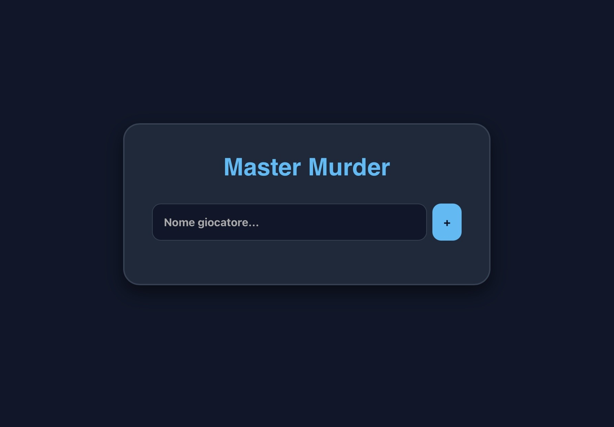

# MasterMurder

MasterMurder è un party game multiplayer locale ispirato a One Word Edition. I civili conoscono la parola segreta, mentre gli impostori ricevono solo un indizio e devono mimetizzarsi tra gli altri giocatori.

Il gioco include:

- Multiplayer locale da 3+ giocatori
- Supporto per uno o più impostori
- Database casuale di parole e indizi
- Sistema di votazione integrato
- Ultima chance per l’impostore di indovinare la parola
- Interfaccia responsive moderna e minimalista

È collegato alla repository centrale MasterHub (https://mastersabba.github.io/MasterSabba/), piena di altri minigame.

